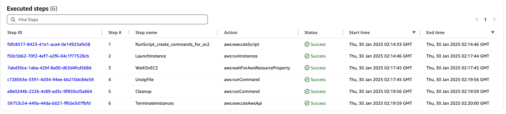

## Solution to Unzip in Amazon S3

This solution will allow users to unzip files in Amazon Simple Storage Service (Amazon S3) without creating any custom code. This pattern uses various AWS services like Amazon S3, AWS Step Functions, AWS Systems Manager (AWS SSM), Amazon Elastic Compute Cloud (Amazon EC2), AWS Identity and Access Management (AWS IAM), Amazon Virtual Private Cloud (Amazon VPC) and Amazon CloudWatch (CW).

The solution creates the following resources to unzip files in Amazon S3:

**AWS Lambda Function(s3unzip-small-files)**: Use this to unzip files that are upto 1GB in size

**AWS Systems Manager Document(s3unzipec2)**: Use this to unzip files of any size, preferably for files larger than 1 GB

**AWS Step Functions State Machine(s3unzip-sf)**: Use this to unzip file of any size. The state machine has in built logic to  execute the AWS Lambda function for files upto 1 GB and AWS Systems Manager Document for larger files

## Sections ##
* [Prerequisites](#prerequisites)
* [Limitations](#limitations)
* [Product Versions](#Product-Versions)
* [Architecture](#architecture)
* [AWS Services](#aws-services)
* [Code](#code)
* [Automation and Scale](#automation-and-scale)
* [Deploy](#deploy)
* [Test](#test)
* [Troubleshooting](#troubleshooting)
* [Sample Workflow Execution](#sample-workflow-execution)

## Prerequisites and limitations ##
### Prerequisites ###
* An active AWS account
* Console and/or CLI access to AWS Step Functions and AWS CloudFormation.
* Amazon VPC, Subnets and Security Groups for AWS Lambda function and Amazon EC2 instances
* Amazon S3 Gateway Endpoint on the Amazon VPC(s) and AWS Private Link for AWS Step Functions and AWS SSM on the Amazon VPC(s) where AWS Lambda function and Amazon EC2 are expected to be launched

### Limitations ###
* This pattern currently supports the following formats - zip, tar.gz, tgz, gz, tar.bz2, tbz, bz2, tar.xz, txz and xz.
* This pattern currently accepts a single compressed file as an input. However, all resources for unzipping the file support concurrent executions. For example, if you have three zip files, you can execute the AWS Lambda function for each of them concurrently. The same is true for the AWS SSM Document and the AWS Step Functions.
* This pattern only unzips the root level compressed file. It would not recursively unzip other compressed files included within the root level compressed file.

### Product Versions ###
* Python 3.12 for AWS Lambda
* al2023-ami-kernel-default-x86_64 image EC2 instances

### Architecture ###

* The user executes the state machine using CLI/API/event driven method
* The state machine throws an error and exits if the target location is not empty
* The state machine checks the size of the zip file provided. If the size is upto 1 GB, it executes the AWS Lambda function. Otherwise it executes the AWS SSM Document unzip the file
* The AWS Lambda function reads zip file from s3, unzips it and uploads the content to the target location
* The AWS SSM Document launches a new Amazon EC2 instance. The Amazon EC2 instance downloads the zip file from Amazon S3, unzip the file and upload the unzipped file(s) to the target location on Amazon S3. The Amazon EC2 instance is terminated at the end of the execution

### AWS services ###

**[AWS Step Functions](https://aws.amazon.com/step-functions/)** – AWS Step Functions is a serverless orchestration service that lets you combine AWS Lambda functions and other AWS services to build business-critical applications. Through the AWS Step Functions graphical console, you see your application’s workflow as a series of event-driven steps

**[AWS Lambda](https://aws.amazon.com/lambda/)** – AWS Lambda is a compute service that lets you run code without provisioning or managing servers. AWS Lambda runs your code only when needed and scales automatically, from a few requests per day to thousands per second

**[AWS Systems Manager](https://aws.amazon.com/systems-manager/)** – AWS Systems Manager is a secure end-to-end management solution for resources on AWS and in multicloud and hybrid environments.

**[Amazon EC2](https://aws.amazon.com/ec2/)** – Amazon EC2 delivers secure, reliable, high-performance, and cost-effective compute infrastructure to meet demanding business needs

**[AWS IAM](https://aws.amazon.com/iam/)** – AWS IAM specifies who or what can access services and resources in AWS, centrally manages fine-grained permissions, and analyzes access to refine permissions across AWS

**[Amazon S3](https://aws.amazon.com/s3/)** – Amazon S3 is an object storage service that offers industry-leading scalability, data availability, security, and performance

### Code ### 
The code for this solution is available in github in the [solution-to-unzip-in-amazon-s3](https://github.com/aws-samples/solution-to-unzip-in-amazon-s3) repository. The code repository contains the following cloud formation templates:

**s3unzip-on-aws-iamroles-global.yaml** – AWS CloudFormation template for creating the IAM roles required for various AWS services used in this pattern. This template needs to be uploaded only once for an AWS account. This template creates four IAM roles - s3unzip-StepFunctions-Role, s3unzip-Lambda-Role, s3unzip-SSM-Role and s3unzip-EC2-Role

**s3unzip-on-aws-services-regional.yaml** –  AWS CloudFormation template for creating the AWS Lambda, AWS Systems Manager Document and AWS Step Functions state machine. This template refers to the roles created by s3unzip-on-aws-iamroles-global.yaml. Hence s3unzip-on-aws-iamroles-global.yaml needs to be uploaded before uploading s3unzip-on-aws-services-regional.yaml. This template needs to be uploaded for each region where this pattern is needed. This template creates an AWS Step Function state machine (s3unzip-sf), an AWS Lambda Function (s3unzip-small-files) and AWS SSM Document (s3unzipec2) and an Amazon CloudWatch Logs (/aws/vendedlogs/states/s3unzip-Logs)

### Automation and scale ###
This solution can be automated using CLIs, APIs and event driven approach. Multiple instances of this solution can be executed in parallel.

### Deploy ###

1. **Create AWS Cloudformation Stack for IAM Roles (only once per AWS account)**:
   
   a. Download s3unzip-on-aws-iamroles-global.yaml from the code repository.
   
   b. Create the AWS Cloudformation stack using this template.
   
   c. Remember to provide all required tags to be applied to the resources created by this AWS Cloudformation stack
   
2. **Create AWS Cloudformation Stack for Other Services (once per Region within the AWS account)**:
   
   a. Download s3unzip-on-aws-services-regional.yaml from the code repository.
   
   b. Create the AWS Cloudformation stack using this template.
   
   c. Remember to provide all required tags to be applied to the resources created by this AWS Cloudformation stack.
   
   d. This template requires three parameters
   
    *VPCId*:The VPC id where the AWS Lambda function should be launched.

    *SubnetIds*: The subnet ids for the AWS Lambda function.

    *SecurityGroupIds*: The Security group ids for the AWS Lambda function.   
 
3. **Create VPC Endpoints**:
   
   *Amazon S3 Gateway Endpoint*: Create an Amazon S3 Gateway Endpoint on the Amazon VPC(s) where AWS Lambda function and Amazon EC2 are expected to be launched.
   
   *AWS Private Link AWS Step Functions and AWS SSM*: Create AWS Private Link for AWS Step Functions and AWS SSM on the Amazon VPC(s) where AWS Lambda function and Amazon EC2 are expected to be launched

### Test ###

1. **Prepare for Testing**:
   
   *Prepare small zip file*: Upload a zip file less than or equal to 1 GB in size to a new or existing S3 bucket
   
   *Prepare large zip file*: Upload a zip file greater than 1 GB in size to a new or existing S3 bucket

2. **Test unzipping a file upto 1 GB using AWS Step Function**:

        a. Navigate to AWS Step Functions Console
 
        b. Open state machine s3unzip-sf
 
        c. Click on Start Execution
 
        d. Provide a JSON as an input. A sample parameter json is included below. Update the parameter values for your use case. 

        {
          "source_bucket": "s3unzip-bucket-8215-use1",
          "source_key": "zipped/sample_data.zip",
          "target_bucket": "s3unzip-bucket-8215-use1",
          "target_prefix": "unzipped/sample_data/",
          "output_bucket": "s3unzip-bucket-8215-use1",
          "instance_type": "t3.medium",
          "SubnetId": "subnet-xxxxab9020df2dxxx",
          "SecurityGroupIds": "sg-xxxxd717b47599xxx"
        }

        source_bucket - Name of the s3 bucket containing the zip file 
  
        source_key - Name of the zip file
  
        target_bucket - Name of the s3 bucket where the unzipped files need to be uploaded
  
        target_prefix - Folder in the target_bucket where the unzipped files need to be uploaded
  
        output_bucket - Name of the s3 bucket where the stderr and stdout from EC2 instance need to be uploaded. This will be used for files larger than 1 GB in size.
  
        instance_type - EC2 instance type for unzipping the files. This will be used for files larger than 1 GB in size.
  
        SubnetId - The subnet id where EC2 should be launched.
  
        SecurityGroupIds - Security group ids for the EC2 instance.

       e. After the execution completes notice that the path chosen was the one that uses Lambda function

       f. Navigate to target_prefix in the target_bucket to validate that the files were unzipped according to the expectations.

3. **Test unzipping a file upto 1 GB using AWS Step Function**:

        a. Re-execute using the same parameters
 
        b. Note that the execution fails with error that the target location is not empty

4. **Test unzipping a file larger than 1 GB using AWS Step Function**:

        a. Navigate to AWS Step Functions Console
 
        b. Open state machine s3unzip-sf
 
        c. Click on Start Execution
 
        d. Provide a JSON as an input. A sample parameter json is included below. Update the parameter values for your use case. 

        {
          "source_bucket": "s3unzip-bucket-8215-use1",
          "source_key": "zipped/small.tar.gz",
          "target_bucket": "s3unzip-bucket-8215-use1",
          "target_prefix": "unzipped/small_tar_gz/",
          "output_bucket": "s3unzip-bucket-8215-use1",
          "instance_type": "t3.medium",
          "SubnetId": "subnet-xxxxab9020df2dxxx",
          "SecurityGroupIds": "sg-xxxxd717b47599xxx"
        }

       e. After the execution completes notice that the path chosen was the one that uses AWS SSM Document

       f. Navigate to target_prefix in the target_bucket to validate that the files were unzipped according to the expectations.

4. **Test unzipping a file upto 1 GB using AWS Lambda function**:

       a. Navigate to AWS Lambda Console

       b. Open function s3unzip-small-files

       c. Navigate to the Test Events Section

       d. Create a new one by clicking on the "Create new test event" button. Give your test event a name and provide the JSON input data that you want to pass to your Lambda function. A sample parameter file is included below. Update the parameter values to fit your use case. 

        {
          "source_bucket": "s3unzip-bucket-8215-use1",
          "source_key": "zipped/sample_data.zip",
          "target_bucket": "s3unzip-bucket-8215-use1",
          "target_prefix": "unzipped/sample_data/",
          "output_bucket": "s3unzip-bucket-8215-use1",
        }

       e. After the execution completes, review the execution details to validate successful completion. 

       f. Navigate to target_prefix in the target_bucket to validate that the files were unzipped according to the expectations.

       g. Re-execute the lambda function with the same payload

       h. Notice the failure with error message that the target location is not empty
   
5. **Test unzipping file larger than 1 GB using AWS SSM Document**:

       a. Navigate to AWS Systems Manager Console

       b. Open document s3unzipec2

       c. Click the “Execute Automation” button at the top right corner

       d. Provide Input Parameters. A sample parameter file is included below. Update the parameter values for your use case. 

       {

       "SourceBucket":["my-s3unzip-bucket"], 
       "SourceKey":["zipped/sample_data.tar.gz"], 
       "TargetBucket":["my-s3unzip-bucket"], 
       "TargetPrefix":["unzipped/sample_data-tar-gz/"], 
       "OutputBucket":["my-s3unzip-bucket"], 
       "InstanceType":["t3.medium"], 
       "SubnetId":["subnet-xxxxc4cb0391a9xxxx"], 
       "SecurityGroupIds":["sg-xxxx7636f9a92exxx"]
       }

       e. Monitor the progress of execution.

       f. After the execution completes, review the execution details to validate successful completion. 

       g. Navigate to target_prefix in the target_bucket to validate that the files were unzipped according to the expectations.

       h. Re-execute the automation with same Input parameters

       i. Notice the failure with error message that the target location is not empty

### Troubleshooting ###

**AWS Cloudformation Stack Creation Failure**: You may get this error when creating the AWS Cloudformation stack using s3unzip-on-aws-iamroles-global.yaml. This will happen if you have already uploaded this template for an account. This template creates global resources (IAM role). Therefore it needs to be uploaded only once per account. If you need to install this solution in another region only s3unzip-on-aws-services-regional.yaml needs to be uploaded

**Solution exits with failure that target location is not empty despite the target location being empty**: Check that the target_prefix parameter includes a “/” at the end

**General troubleshooting checklist**:

* Create an Amazon S3 Gateway Endpoint on the Amazon VPC(s) where AWS Lambda function and Amazon EC2 are expected to be launched. Without this endpoint, the Lambda and EC2 execution will hang and eventually timeout

* Create AWS Private Link for AWS Step Functions and AWS SSM on the Amazon VPC(s) where AWS Lambda function and Amazon EC2 are expected to be launched. This will prevent the traffic between S3 and AWS Step Functions and AWS SSM from traversing the public internet

* Ensure that the source and target bucket parameters are in the same region where the AWS Step Functions/AWS Lambda function/AWS SSM Document is being executed

* When providing the source_key parameter, ensure that the file type is one of the supported formats - zip, tar.gz, tgz, gz, tar.bz2, tbz, bz2, tar.xz, txz and xz

* Ensure that the target location is empty before executing the solution

### Sample Workflow Execution ###

1. The following diagram shows the AWS Step Functions execution graph view for a successful processing of files upto 1 GB using Lambda

2. The following diagram shows the AWS Step Functions execution graph view for an unsuccessful run because the target location for uploading unzipped files is not empty.

3. The following diagram shows the AWS Step Functions workflow for a successful processing of files larger than 1 GB using SSM Document.

4. The following diagram shows the SSM Document Execution for successful processing of files larger than 1 GB

## Security

See [CONTRIBUTING](CONTRIBUTING.md#security-issue-notifications) for more information.

## License

This library is licensed under the MIT-0 License. See the LICENSE file.

